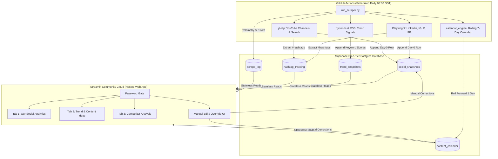

# Revent AI Lab — Content Intelligence Dashboard

A free, zero-paid-API, no-login content intelligence and competitor benchmarking dashboard built for **Revent AI Lab** (UAE, KSA, and Egypt SME focus).

The system consists of two decoupled components:
1. **Automated Daily Scraper (GitHub Actions)**: Runs headless scraping (Playwright, yt-dlp, pytrends, Google News RSS, Reddit) once every 24h on a schedule, writing snapshot metrics into a free Supabase Postgres database.
2. **Stateless Team Dashboard (Streamlit Community Cloud)**: Hosted on a shared URL, protected by a team password gate, reading exclusively from Supabase to render interactive Plotly analytics, rolling 7-day content calendars, and competitor benchmarking.

---

## 🏗️ System Architecture



---

## 🚀 Quick Setup Guide

### 1. Supabase Setup (Database)
1. Sign up for free at [supabase.com](https://supabase.com).
2. Create a new organization and project (e.g. `revent-content-intel`).
3. In the left navigation, open the **SQL Editor**.
4. Copy and paste the contents of [`schema.sql`](file:///Users/asheshthakur/Documents/Revent/content-intel-dashboard/schema.sql) into the query editor and click **Run**.
5. Navigate to **Project Settings** → **API**:
   - Copy the **Project URL** (`https://xyzcompany.supabase.co`).
   - Copy the **anon (public)** key.
   - Copy the **service_role (secret)** key (keep this secret!).

---

### 2. GitHub Repository Setup (Automation)
1. Push this `content-intel-dashboard` project to your GitHub repository.
2. Go to **Settings** → **Secrets and variables** → **Actions**.
3. Add the following repository secrets:
   - `SUPABASE_URL`: Your Supabase Project URL.
   - `SUPABASE_SERVICE_KEY`: Your Supabase `service_role` secret key.
4. Go to the **Actions** tab in your repository, select **Daily Content Intelligence Scraper**, and click **Run workflow** to test an initial manual run.

---

### 3. Streamlit Community Cloud Setup (Hosting)
1. Go to [share.streamlit.io](https://share.streamlit.io) and log in with GitHub.
2. Click **New app** and configure:
   - **Repository**: Your GitHub repository.
   - **Branch**: `main`.
   - **Main file path**: `app/streamlit_app.py`.
3. In **Advanced settings** → **Secrets**, paste:

```toml
SUPABASE_URL = "https://your-project-id.supabase.co"
SUPABASE_KEY = "your-anon-public-key"
DASHBOARD_PASSWORD = "your-chosen-team-password"
```

4. Click **Deploy!** Your whole team can now view and interact with the dashboard from any browser via the provided Streamlit URL.

---

## ⚙️ Local Development & Testing

To test or inspect the dashboard locally:

```bash
cd content-intel-dashboard

# 1. Create and activate a virtual environment
python3 -m venv .venv
source .venv/bin/activate

# 2. Install dependencies
pip install -r requirements.txt

# 3. Install Playwright browser binaries
playwright install chromium

# 4. Configure local secrets
cp .streamlit/secrets.toml.example .streamlit/secrets.toml
# Edit .streamlit/secrets.toml with your Supabase credentials

# 5. Run the Streamlit dashboard
streamlit run app/streamlit_app.py
```

To run a test scrape locally:
```bash
export SUPABASE_URL="https://your-project.supabase.co"
export SUPABASE_SERVICE_KEY="your-service-role-key"
python run_scraper.py
```

---

## 📊 Dashboard Modules

### Tab 1 — Our Social Analytics
- **Platform selector**: Facebook, Instagram, YouTube, LinkedIn, X.
- **KPI Summary Cards**: Followers, % growth delta vs. window start.
- **Plotly Charts**:
  - Follower / Subscriber growth over time with delta callout.
  - Average engagement rate trend (`(likes + comments + shares) / followers`).
  - Average like rate per post.
- **7 / 30 / 60 / 90-Day Range Filter**: Dynamic Day-0 relative time slicing.
- **Manual Override / Add Snapshot**: Correct bad scrapes or backfill missing days directly in the UI.

### Tab 2 — Trend & Content Idea Engine
- **Trend Ingestion**: Google Trends (UAE, KSA, Egypt), Google News RSS, YouTube video search, Reddit public endpoints (`r/artificial`, `r/automation`).
- **Ranked Industry Keywords Table**: Filterable by 7, 30, and 60 days.
- **Rolling 7-Day Content Calendar**:
  - **YouTube**: Max 1 long-form, max 2 short-form/week.
  - **Socials (LinkedIn, IG, X, FB)**: Max 2 short-form, 1-2 carousel, 2 static/week with deliberate gap days.
  - **Instagram Stories**: Independent alternate-day track with polls, quizzes, and AMAs.
  - **No duplicate topics**: Enforced uniqueness across the 7-day rolling window.
  - **Structured output**: Topic, Hook, Body (bullet points), CTA, and Best Time (GST).
- **Inline Calendar Editor**: Edit hooks, body copy, and post times directly in the UI.

### Tab 3 — Competitor Analysis
- **Tracked Competitors**: Implement AI, Anvenssa AI, Maqsam, Lucidya, Dataiku, Ahrefs, Semrush.
- **Combined Growth Chart**: Multi-line Plotly visualization comparing Revent against all competitors on followers, engagement rate, or avg likes.
- **Hashtag Frequency Table**: Extracted from competitor post captions.
- **Content Gap Analysis**: Cross-references competitor post captions against the core `NICHE_KEYWORDS` taxonomy to flag topics competitors talk about that Revent has not covered.
- **Top-Performing Content**: Displays top-performing competitor posts ranked by engagement.

---

## ⚠️ Known Fragile Points & Anti-Bot Mitigations

Public scraping without authentication or paid APIs operates in an adversarial environment. Major platforms frequently update DOM selectors and deploy anti-scraping walls. Here is how the system is engineered to handle breakage:

| Platform | Fragility Level | Expected Failure Modes | Engineering Countermeasures |
| :--- | :--- | :--- | :--- |
| **YouTube** | 🟢 Low | Very rare; yt-dlp is maintained specifically for YouTube extraction. | `yt-dlp` extracts subscriber count and video metadata without browser emulation. |
| **Google Trends** | 🟡 Medium | Rate limiting on rapid bursts (`429 Too Many Requests`). | 5-keyword batching, 3-5s random delays, and 10s backoff retries. |
| **Google News RSS** | 🟢 Low | Almost zero failure rate. | Standard public RSS feed parsed via `feedparser`. |
| **Reddit** | 🟢 Low | Periodic rate limits on unauthenticated `.json` requests. | Realistic User-Agent rotation, 2-5s delays between requests. |
| **X (Twitter)** | 🔴 High | Aggressive login prompts, dynamic class names. | Dual-strategy: queries public Nitter mirrors first; falls back to Playwright with `aria-label` extraction. |
| **LinkedIn** | 🔴 High | `authwall` redirects on public company profiles. | Checks for authwall; attempts fallback `/about/` subpath; graceful skip on hard block. |
| **Instagram** | 🔴 High | Login dialogs obscuring profile feeds. | Extracts follower count from `<meta property="og:description">` and `_sharedData` JSON blobs before DOM parsing. |
| **Facebook** | 🟡 Medium | Heavy JS, cookie banners, regional overlays. | Playwright handles cookie consent dismissal; searches page text regex for follower counts. |

### Architectural Guarantees:
1. **Isolated Execution**: Every target scrape is wrapped in an individual `try/except`. If LinkedIn fails, YouTube and Instagram continue unaffected.
2. **Stateless App Decoupling**: The Streamlit dashboard **never** scrapes live on page load. It only reads whatever exists in Supabase. A failed scrape run never breaks or delays the dashboard.
3. **Manual Override UI**: Any team member can enter or correct data points directly from Tab 1 and Tab 2, ensuring historical trendlines remain accurate even during platform redesigns.
